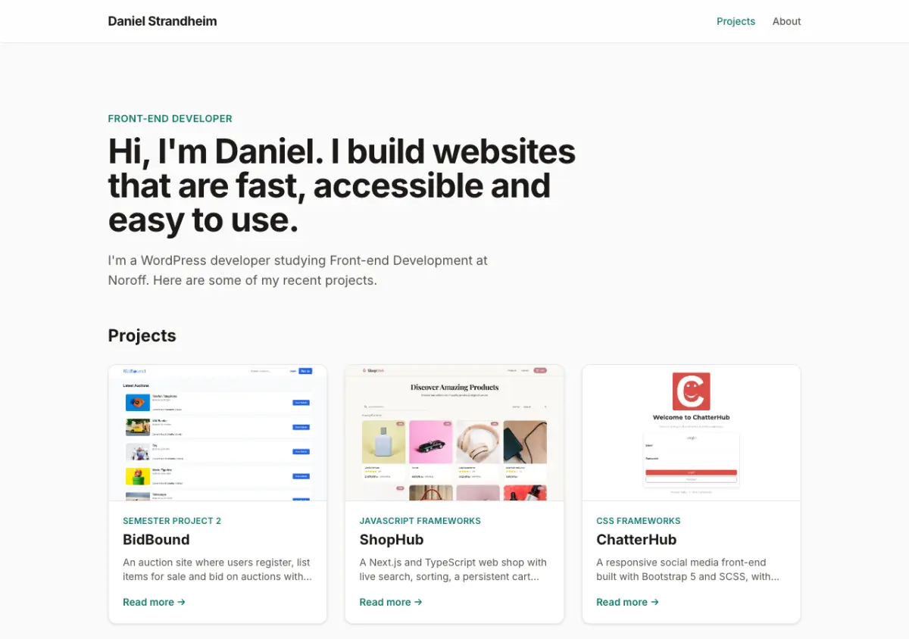

# Portfolio 2 – Daniel Strandheim



My personal front-end portfolio, built for the Noroff Portfolio 2 course assignment. It features three projects, each with its own article page.

**Live site:** _coming soon_

## Built with

- [React](https://react.dev/) 19
- [React Router](https://reactrouter.com/) for the multipage routing
- [Tailwind CSS](https://tailwindcss.com/) v4
- [Vite](https://vite.dev/)
- Deployed on [Netlify](https://www.netlify.com/)

## Featured projects

| Project | Course | Live | Repo |
| --- | --- | --- | --- |
| BidBound | Semester Project 2 | [Live](https://bidbound-semester-project2.netlify.app) | [GitHub](https://github.com/Daniel-leiken/Semester-Project-2) |
| ShopHub | JavaScript Frameworks | [Live](https://javascript-frameworks-ca-daniel.netlify.app) | [GitHub](https://github.com/Daniel-leiken/javascript-frameworks-ca) |
| ChatterHub | CSS Frameworks | [Live](https://css-frameworks-danielleiken.netlify.app) | [GitHub](https://github.com/Daniel-leiken/css-frameworks-ca-danielstrandheim) |

## Getting started

```bash
git clone https://github.com/Daniel-leiken/Portfolio-2.git
cd Portfolio-2
npm install
npm run dev
```

Build for production with `npm run build`. The output goes to `dist/`.

## Project structure

```
src/
  components/   Layout, ProjectCard, ShareButton
  data/         projects.js – content for the teaser cards and article pages
  pages/        Home, Project (article page), NotFound
public/
  images/       Optimised webp screenshots (all under 200 KB)
  _redirects    Netlify rule so article URLs work on refresh
```

To add or edit a project, update `src/data/projects.js`.

## Contact

- [GitHub](https://github.com/Daniel-leiken)
- [LinkedIn](https://www.linkedin.com/in/daniel-strandheim)
